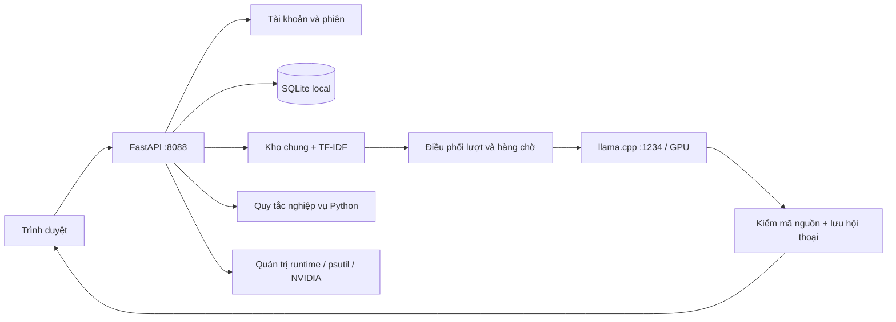

# Kiến trúc và luồng dữ liệu

[Về README](../README.md) · [Cài đặt](SETUP.md)

Đọc tài liệu này để thay đổi code hoặc hiểu cách các thành phần phối hợp; người cài lần đầu nên hoàn tất SETUP trước.



## Thành phần

| File | Trách nhiệm |
|---|---|
| `app.py` | API, lọc tài liệu, RAG, chat, tài chính và duyệt nguồn |
| `accounts.py` | scrypt, token phiên băm, tài khoản, heartbeat, thu hồi |
| `conversations.py` | Cuộc trò chuyện theo user, phân trang, xóa có kiểm quyền |
| `generation.py` | Hạn chế số lượt đang sinh, hàng chờ và bảo trì độc quyền |
| `runtime_limits.py` | Giới hạn phần mềm và công thức ngân sách token dùng chung |
| `system_runtime.py` | Thông số máy, cấu hình, xác định/dừng/bật đúng model |
| `admin_system.py` | API quản trị runtime, ngân sách token, log, backup |
| `business.py`, `finance_logic.py` | Số liệu có cấu trúc, tính tiền, nhận diện chủ đề |
| `static/` | HTML/CSS/JavaScript cùng origin; không CDN |

## Một câu hỏi

1. Xác thực cookie và chủ cuộc trò chuyện. Chặn hai câu chồng lên cùng cuộc trò chuyện đang xử lý.
2. Đọc nguồn đã duyệt/còn hiệu lực; nguồn phụ thuộc thiếu tài liệu gốc bị loại. Kho đọc chung không lọc theo role hoặc khách.
3. Câu tiếp nối ngắn có thể dùng chủ đề trước trong đúng conversation. Không gửi toàn bộ lịch sử vào model.
4. Câu có số liệu chuẩn được trả bởi Python. Câu cần tổng hợp được xếp hạng bằng TF-IDF word/character trên CPU, lấy tối đa 4 nguồn và giới hạn độ dài nguồn.
5. Lượt cần model lấy slot của backend; tối đa 16 yêu cầu chờ, timeout chờ 180 giây. Model có số slot theo cấu hình khởi động.
6. Backend gửi câu hỏi, nguồn và schema JSON đến model cùng API key local. Giới hạn request model hiện 180 giây; context cao có thể vượt thời gian này.
7. Kiểm mã trích dẫn, kiểm lại phiên/hiệu lực nguồn, lưu câu hỏi và kết quả theo user/conversation, trả về trình duyệt. Kiểm mã trích dẫn không chứng minh mọi nhận định đúng.

## Dữ liệu bền vững

`users`, `sessions`, `login_attempts` phục vụ xác thực. `docs` chứa JSON tài liệu. `conversations` và `chats` giữ hội thoại; `feedback` giữ đánh giá; `audit` ghi thao tác. Các bảng dự toán cũ nếu có được giữ trong DB nhưng không còn API module dịch vụ.

Xóa conversation dùng transaction: kiểm chủ sở hữu → xóa feedback của các lượt → xóa chats → bỏ liên kết session → xóa conversation → audit ID. Endpoint async dùng cùng event loop với tập conversation đang xử lý; không chạy nhiều uvicorn worker vì khóa/tập đang xử lý nằm trong bộ nhớ một tiến trình.

## API chính

| Endpoint | Quyền / tác dụng |
|---|---|
| `POST /api/login`, `/api/logout` | Tạo/thu hồi phiên |
| `GET /api/documents`, `/api/documents/{id}` | Mọi user đăng nhập đọc kho chung |
| `POST /api/chat` | `question`, `conversation_id` tùy chọn |
| `GET/POST /api/conversations` | Danh sách riêng / tạo mới |
| `GET/DELETE /api/conversations/{id}` | Đọc/xóa của chính tài khoản |
| `GET /api/admin/system` | Telemetry, giới hạn, ngân sách saved/running |
| `PUT /api/admin/system/config` | Lưu cấu hình có kiểm tổng context |
| `POST /api/admin/system/model` | start/stop/restart, chỉ quản trị |
| `GET /api/admin/users` | Tài khoản và phiên online, chỉ quản trị |

Admin có trang hội thoại toàn hệ thống; lịch sử cá nhân vẫn là của chính admin. Dashboard hồ sơ/tài chính giữ bộ lọc khách được phân công nhưng nguồn đã chia sẻ trong kho chung không còn bí mật theo nhóm khách.

## Cấu trúc sau khi cài từ repo

```text
repo/
  app.py, accounts.py, conversations.py, generation.py
  system_runtime.py, admin_system.py, runtime_limits.py
  business.py, finance_logic.py, *_data.py
  Start-Demo.ps1, Stop-Demo.ps1, Restart-App.ps1
  requirements-lock.txt
  static/       giao diện cùng origin
  docs/         hướng dẫn dùng/cài/phát triển
  examples/     cấu hình mẫu có thể commit
  data/         seed tổng hợp + DB/credential local (DB/secret bị ignore)
  models/       manifest có thể commit + GGUF tải riêng
  runtime/      executable/DLL tải riêng
  .venv-runtime/ Python local
  logs/         tạo khi chạy
  artifacts/    tạo khi test
  backups/      tạo khi backup
```

`exports/` không phải thành phần runtime. Trình duyệt không đọc trực tiếp file Python/SQLite; mọi dữ liệu qua API có xác thực. Static được phục vụ từ backend, không mở index.html bằng file:// để chạy ứng dụng.
